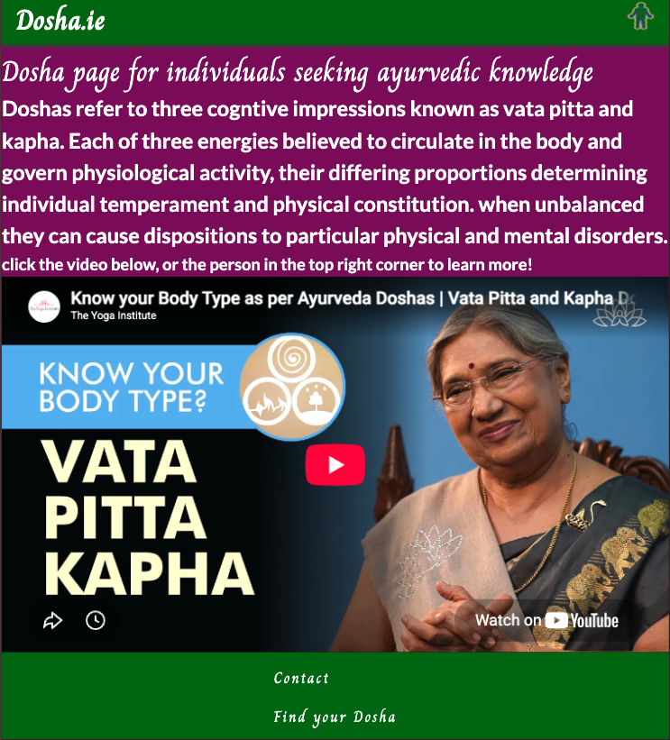
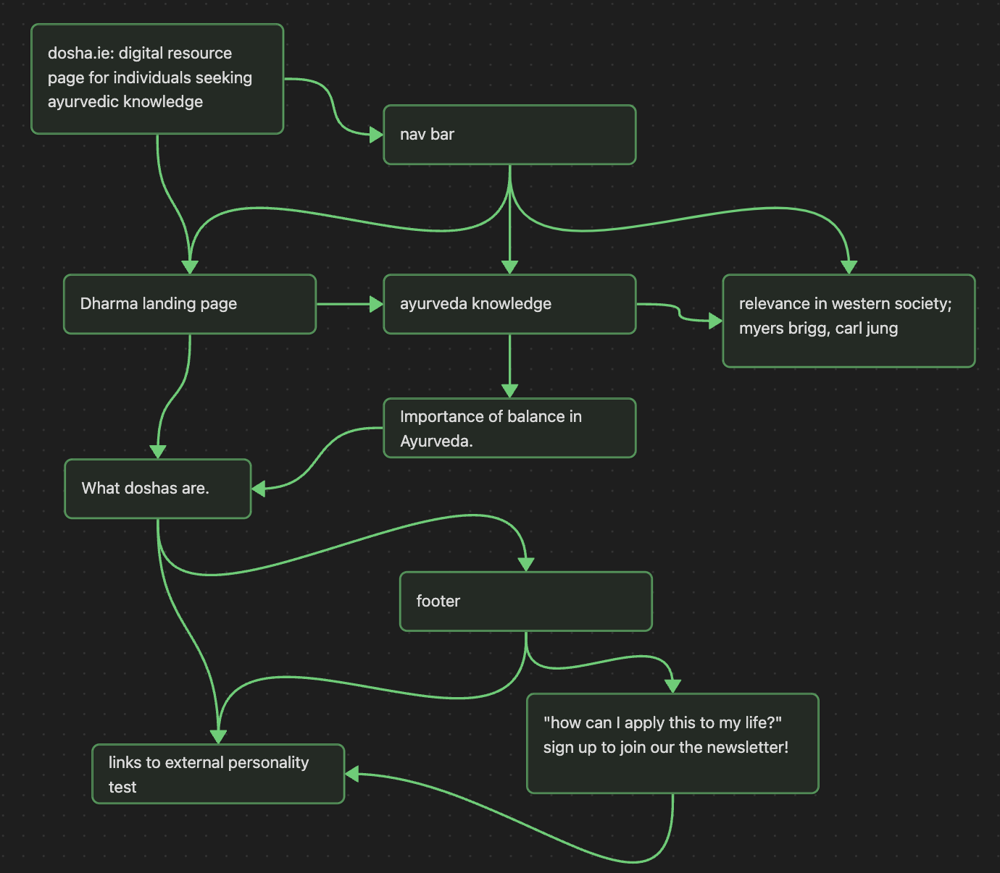

# dosha.ie

Dosha.ie is a website for people focused on complementary therapy education, offering an introduction to Ayurveda, the traditional practice of medicine in Hinduism, as a framework for understanding individual constitution and wellbeing.
The site is built as a multi-page HTML/CSS project with a responsive mobile-first layout, a JavaScript-free navigation toggle, and custom typography using Google Fonts (Charm and Lato). Rather than a conventional hamburger icon, the nav toggle reuses the site's favicon image, a deliberate design choice that ties the navigation into the site's visual identity.

The content provides introductory information on Ayurveda, guiding visitors toward discovering their "dosha," or cognitive fingerprint through the three energies — vata, pitta, and kapha. This is supported by an embedded YouTube video explaining the doshas and a link to an external personality test for users who want a practical starting point. Additional pages expand on related topics such as Dharma, Balance, Ayurveda, and Relevance, giving users a structured path through the site.

## Features

1. Navigation Bar

- Present on all six pages with identical layout for consistent navigation.
- Links to Home via the logo, plus Dharma, Balance, Ayurveda, and Relevance in the menu.
- Mobile: collapses into a toggle shown as the site favicon (a rainbow silhouette representing the doshas). Desktop: displays inline.
- Lets users move between pages on any device without using the back button.

2. Home Page (`index.html`)

- Introduces Dosha.ie and the three doshas (vata, pitta, kapha).
- Embeds a YouTube video explaining body types per Ayurveda.
- Highlights the nav toggle image and video as the two ways to explore further.

3. Dharma Page (`dharma.html`)

- Introduces dharma as a core concept in Hinduism, Buddhism, and other Eastern philosophies, covering duty, moral responsibility, and spiritual purpose.
- Explores how dharma is tested when duties conflict (e.g., business leaders balancing employees, customers, and shareholders) and how it guides ethical decision-making.
- Details specific virtues such as **Ahimsa** (non-violence) and **Yoga** as disciplined spiritual practice, each with supporting imagery.

4. Balance Page (`balance.html`)

- Explores balancing competing interests through Dharma — finding a middle path between personal and collective responsibilities.
- Introduces Prakriti (Ayurvedic constitution) as the foundation for making choices that align with one's nature.
- Connects Dharma and Prakriti as complementary guides for ethical, balanced living.
- Embeds a YouTube video on a doctor's guide to meditation.

5. Ayurveda Page (`what_is_ayurveda.html`)

- Provides an overview of Ayurveda as an ancient Indian system of medicine, covering its origins and Sanskrit meaning ("ayur" = life, "veda" = knowledge).
- Explains the three doshas (Vata, Pitta, Kapha), the five elements, and how balancing them supports physical and mental wellbeing.
- Outlines the benefits of Ayurvedic practice — natural healing, improved digestion, reduced stress, better sleep — with a concluding section on holistic health.
- Features a hero image of an Ayurvedic garden setting to reinforce the holistic-therapy theme.

6. Relevance Page (`relevance.html`)

- Explores why Ayurvedic principles still matter in Western society, comparing the doshas to modern psychological frameworks.
- Draws parallels between the doshas and the Myers-Briggs Type Indicator (Vata/Intuition, Pitta/Thinking, Kapha/Sensing).
- Links the doshas to Carl Jung's archetypes (Vata/Anima, Kapha/Self), framing Ayurveda as compatible with Western psychology.
- Suggests practical applications for each dosha type — grounding for Vata, stress management for Pitta, avoiding complacency for Kapha.

7. Sign-Up Page (`email_signup.html`)

- Contact/sign-up form for users wanting Dosha-related tips and updates.
- Collects first name, last name, and email (all required fields).
- Radio button selection lets users pick which dosha (Vata, Pitta, Kapha) they want tips for — Vata is pre-selected.
- Form submits via POST to Code Institute's formdump endpoint for testing.
- Includes an Ayurvedic diagram image (the five elements and three doshas) above the form.

8. Footer

- Repeats on every page with links to Contact and an external "Find your Dosha" test.
- External link opens in a new tab with `rel="noopener noreferrer"` for safety.

9. External Dosha Test

- Links to Kripalu's "What's Your Dosha?" quiz.
- Gives users a practical, interactive starting point beyond the site's info.

## Testing

### Features Testing

| Feature                           | Test                                                         | Result                                                                             |
| --------------------------------- | ------------------------------------------------------------ | ---------------------------------------------------------------------------------- |
| Navigation toggle (favicon image) | Tap the favicon icon on mobile; nav should open/close        | ✅ Works — checkbox state controls nav display via `:checked ~ nav`                |
| Navigation links                  | Click each link (Home, Dharma, Balance, Ayurveda, Relevance) | ✅ All routes correct, active state shows purple underline                         |
| Active page indicator             | Load each page; current page should show underline           | ✅ `.active` class applies correctly                                               |
| Header (fixed)                    | Scroll the page; header stays at top                         | ✅ `position: fixed` with `z-index: 99`                                            |
| Footer links                      | Click "Contact" and "Find your Dosha"                        | ✅ Internal link works; external opens in new tab with `rel="noopener noreferrer"` |
| YouTube embed                     | Video loads and plays inline                                 | ✅ Renders via YouTube's official embed feature                                    |
| Responsive video                  | Resize below 560px; video shrinks to fit                     | ✅ `width: 100%; aspect-ratio: 16/9`                                               |
| Fonts                             | Charm + Lato load from Google Fonts                          | ✅ `@import` in stylesheet                                                         |
| Favicon                           | Visible in browser tab                                       | ✅ Linked in `<head>`                                                              |

### Responsive Design

Tested at the following breakpoints using browser DevTools and a multi-viewport preview tool:

- **Below 768px (mobile)** — Hamburger toggle shows favicon image; nav hidden until checked; footer stacks vertically; main content full width.
- **768px and up (tablet/desktop)** — Toggle hidden; nav displays inline horizontally; footer links sit in a row; layout expands.

### Browser Testing

| Browser                        | Result               |
| ------------------------------ | -------------------- |
| Chrome (desktop + mobile view) | ✅ Works as intended |
| Firefox                        | ✅ Works as intended |
| Safari (iOS)                   | ✅ Works as intended |
| Edge                           | ✅ Works as intended |

### Bugs Found & Fixed

- **Duplicate IDs (`#menu` on both `<nav>` and `<footer>`)** — flagged by Nu HTML Checker. Fixed by changing to `.menu` class for shared styling.
- **Nav toggle hidden on all screen sizes** — `.nav-toggle-label { display: none; }` was outside any media query. Moved inside the 768px+ query so it only hides on desktop.
- **Bullet points on nav list** — `list-style-type: none` was applied to the wrong element. Added `.menu ul { list-style-type: none; }`.
- **Footer breaking below 560px** — caused by fixed-width YouTube iframe. Fixed with `max-width: 100%` and `aspect-ratio`.
- **Layout breaking above 768px** — most rules were trapped inside the mobile-only media query. Separated into general / mobile / tablet blocks.

### Known Issues

None outstanding at time of submission.

### Validator Results

- **HTML** — No errors or warnings (Nu HTML Checker, tested via deployed URL).
- **CSS** — No errors (W3C CSS Validator).

## Wireframe

## Deployment

The site is deployed via GitHub Pages. To deploy:

1. Push code to the `main` branch of the GitHub repository.
2. Go to Settings → Pages → Source → select `main` branch.
3. Site published at `https://c4ller8.github.io/dosha_ie/`.

## Credits

### Content

- The Ayurvedic terminology and descriptions throughout the site are drawn from publicly available resources on Ayurveda, including Wikipedia and Kripalu.
- The "Find your Dosha" quiz linked in the footer is hosted by [Kripalu](https://kripalu.org/content/whats-your-dosha).

### Media

- YouTube video "Know your Body Type as per Ayurveda Doshas | Vata Pitta and Kapha Doshas Explained" by The Yoga Institute — embedded via YouTube's official embed feature. All rights belong to the original creator.
- YouTube video on meditation by Dr. Alok Kanojia of HealthyGamerGG — embedded via YouTube's official embed feature. All rights belong to the original creator.
- Favicon and site icons generated via [Favicon.io](https://favicon.io/)
- Images sourced via Google Images for educational purposes. All rights belong to their original creators.

### Code

- Form submission endpoint (`https://formdump.codeinstitute.net`) provided by Code Institute for testing purposes.
- All other code written by the author.
